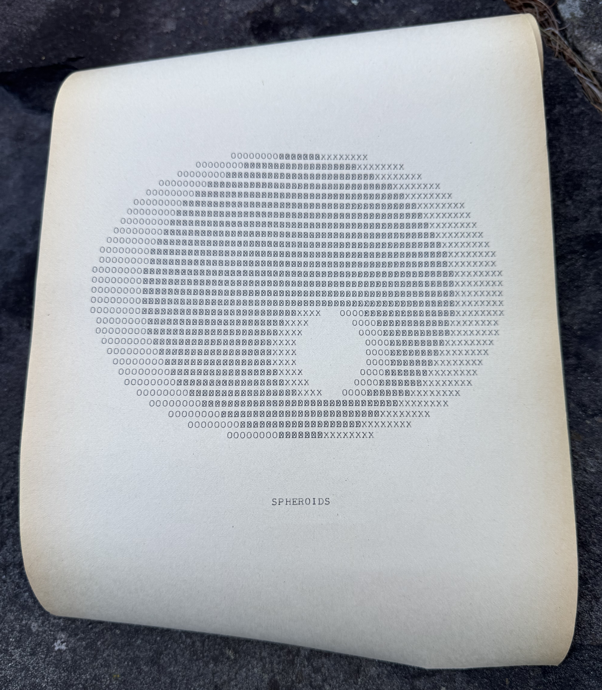

# Hermes Agent Skills

Teletype ASR33 was the original terminal for Unix. The first ASCII machine.
Mechanical keyboard and printer, a legacy of the telegraph age.

This repo contains skills, and a custom theme and dashboard, for talking to
Hermes Agent using a Teletype Model 33 emulator.  It includes audio recordings
from a restored Teletype.

Video (sound on!):

https://github.com/user-attachments/assets/f03328b8-2fb0-4c67-b8b0-dc36a3ad014f

If you have a *real* Teletype ASR33, you can use [hermes-shell](https://github.com/hughpyle/hermes-shell)
as the back-end, which provides a command-line shell that you can use
with `getty` for interactive login.

## Using this repo with Hermes

First there are skills for overstrike ASCII art (including emoji!) and
paper-tape patterns (if you have a tape punch).  A few overstrike artworks
are included here, and the [ASR33 repo](https://github.com/hughpyle/asr33) has tools for generating them.

Add as a skill source:

```bash
hermes skills tap add hughpyle/hermes-skills
```

Then browse, search, or install skills with the Hermes skills hub.

## Teletype Plugin (dashboard)

A Hermes dashboard plugin (`plugins/teletype`) and matching theme
(`themes/teletype.yaml`) that turn the dashboard into a Model 33 ASR
teletype: 72-column uppercase paper roll, 10 cps electromechanical
printing with motor hum, key clack, print clack, carriage-return
thunk, and margin bell.  Oil smells are not included.

Chat is bridged to the local Hermes API
server via `/v1/chat/completions`; replies come back as plain ASCII
and are released into the printer's mechanical 10 cps queue.

See `plugins/teletype/README.md` for the user guide and
`plugins/teletype/DESIGN.md` for the full design.

### Install

```sh
mkdir -p ~/.hermes/plugins ~/.hermes/dashboard-themes
ln -s "$(pwd)/plugins/teletype" ~/.hermes/plugins/teletype
cp themes/teletype.yaml ~/.hermes/dashboard-themes/
```

Restart the Hermes dashboard process so the plugin's API routes are
mounted (a rescan alone is not enough for backend routes).

### Configure

The plugin needs the Hermes API server reachable on localhost. Set
`API_SERVER_KEY` (and optionally `API_SERVER_HOST` / `API_SERVER_PORT`,
defaulting to `127.0.0.1:8642`) in any of:

- `~/.hermes/.env`
- the shell environment that runs the dashboard
- `~/.hermes/config.yaml` under `api_server:`

Then in the dashboard:

1. Open the **Teletype** tab.
2. Pick the **Teletype** theme from the theme switcher (or set
   `dashboard.theme: teletype` in `~/.hermes/config.yaml`).
3. Press any key to boot the motor — required by browser audio policy.

`F7` toggles the lid (mutes audio while keeping the visual).

### Localhost-only

The WebSocket at `/api/plugins/teletype/tty` has no per-request auth
and trusts the dashboard's localhost binding. If you reverse-proxy
the dashboard to anywhere reachable beyond your machine, put your
own auth in front of it.



_Spheroids_, Katherine Nash (1968), recreated on the Teletype Model 33 by Hugh Pyle (2019).
